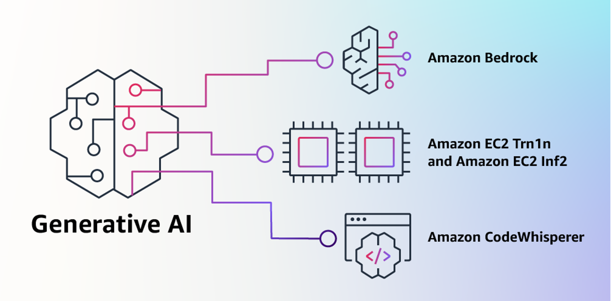

# Building Generative AI Applications with Amazon Bedrock

Welcome to our immersive workshop on building generative AI applications with Amazon Bedrock. This hands-on workshop is designed to equip you with the knowledge and skills to leverage foundation models for a broad spectrum of tasks.



Our learning objectives are:

1. To build a Streamlit application capable of displaying images produced via Stable Diffusion.
2. To build applications that can handle a variety of text based text such as Summarization and Q&A.
3. To build an AI Agent with the capability to generate code and retrieve information from documents.
4. To build a conversational applications such as a chatbot.

By the end of this workshop, you will have gained valuable hands-on experience in building generative AI applications with Amazon Bedrock.

This is a intermediate level workshop, so familiarly with Python and using the terminal is helpful. No AI/ML experience is necessary. This workshop is intended to be finished within 2 hours.

## Prerequisites

**Step 1: Subscribe to Models in the Amazon Bedrock Console**

In the [Amazon Bedrock console](https://us-east-1.console.aws.amazon.com/bedrock/home?region=us-east-1#/modelaccess), select Model access in the left navigation pane and enable the models you would like to access. Once the model access is enabled, you can then use the API.

**Note:** For Claude models you have to enter some extra details, but you will get access instantly.

**Step 2: Check your Python version**

Make sure you're running [Python 3.9](https://www.python.org/getit/) or higher. If you're not, update it. Trust me, it'll make your life easier.

```bash
python --version
```

**Step 3: Install the essentials**

First, clone the repo, and run the following command to grab the libraries you’ll need for this guide.

```bash
git clone https://github.com/aws-banjo/intro_bedrock_workshop.git
cd intro_bedrock_workshop
pip install requirements.txt
```
**(Optional) Step 4: Enable Amazon CodeWhisperer**

Activate [Amazon's CodeWhisperer](https://aws.amazon.com/codewhisperer/), your AI assistant that will guide you through coding challenges during this workshop. Watch this video to learn how to install it in your environment, or read the [setup guide](https://docs.aws.amazon.com/codewhisperer/latest/userguide/whisper-setup-indv-devs.html).

<a href="http://www.youtube.com/watch?feature=player_embedded&v=sFh3_cMUrMk" target="_blank">
 
</a>

Alright, you're all set to start building your next generative AI masterpiece with Amazon Bedrock. Click on one of the modules to get started.

* [Image Module](image_module/README.md)
* [Text Module](text_module/README.md)
* [Chat Module](chat_module/README.md)
* [Agent Module](agent_module/README.md)