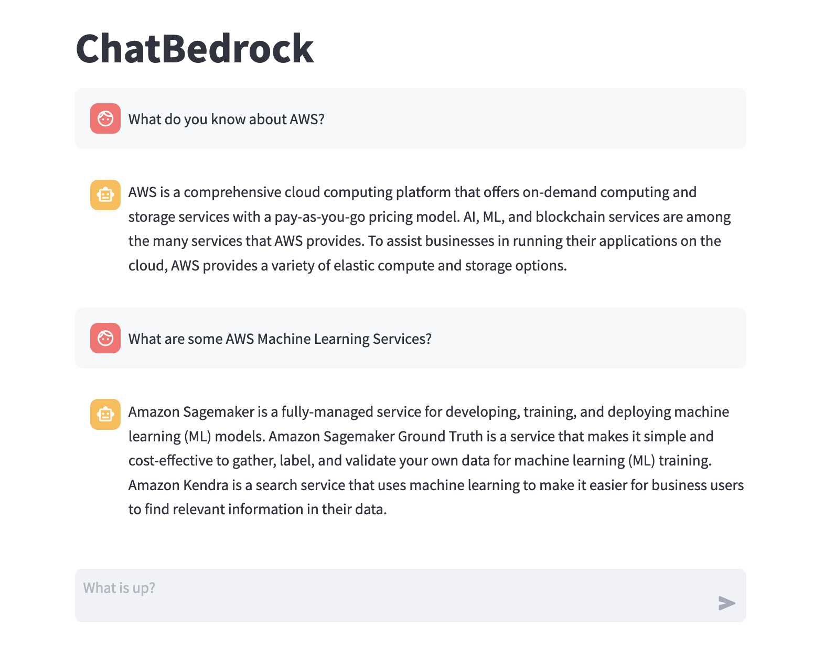

# Building Conversational Applications with Amazon Bedrock"

In this module, we'll build a chatbot leveraging Amazon Bedrock, LangChain, and Streamlit.



## Initialzing Bedrock with LangChain

First things first, we need to initialize Amazon Bedrock in our codebase. Head over to the `chat_bedrock_st.py` file where we'll be making the necessary adjustments.

We'll utilize the `@st.cache_resource` decorator to cache the LLM instance as it doesn't need to be recreated every run.

```python
@st.cache_resource
def load_llm():
    llm = Bedrock(client=bedrock_runtime, model_id="anthropic.claude-v2")
    llm.model_kwargs = {"temperature": 0.7, "max_tokens_to_sample": 2048}

    model = ConversationChain(llm=llm, verbose=True, memory=ConversationBufferMemory())

    return model

model = load_llm()
```

## Building the UI

Let's conceptualize the essential components for our chatbot UI:

1. Two separate chat message containers to display messages from the user and the bot.
2. A chat input widget for user message input.
3. A mechanism to store and display chat history in the chat message containers. We'll use a list storing dictionaries that represent each message with keys 'role' (author) and 'content' (message).

```python
# Initialize chat history
if "messages" not in st.session_state:
    st.session_state.messages = []

# Display chat messages from history on app rerun
for message in st.session_state.messages:
    with st.chat_message(message["role"]):
        st.markdown(message["content"])
```

In the above code, we initialize the chat history list in session state if it doesn't exist and iterate through the chat history to display each message.

Next, let's implement user input functionality, display user messages, and add them to chat history.

```python
# React to user input
if prompt := st.chat_input("What is up?"):
    # Display user message in chat message container
    st.chat_message("user").markdown(prompt)
    # Add user message to chat history
    st.session_state.messages.append({"role": "user", "content": prompt})
```

This snippet captures user input, displays the user's message, and appends it to the chat history.

Next, we generate the chatbot's responses and add them to the chat history.

```python
    with st.chat_message("assistant"):
        message_placeholder = st.empty()
        full_response = ""

        result = model.predict(input=prompt)
```

Finally, let's add a streaming output mode to simulate chatbot's thinking process.

```python
        # Simulate stream of response with milliseconds delay
        for chunk in result.split():
            full_response += chunk + " "
            time.sleep(0.05)
            # Add a blinking cursor to simulate typing
            message_placeholder.markdown(full_response + "▌")

        message_placeholder.markdown(full_response)
```

This snippet creates a streaming effect by displaying the chatbot's response word by word, with a delay to mimic the bot's "thinking" time.

And voila! With approximately 50 lines of code, we've built a fully functional chatbot application using Amazon Bedrock.

Now test your chatbot by running

```bash
streamlit run chat_bedrock_st.py
```

Full code is located here `chat_full_bedrock_st.py`