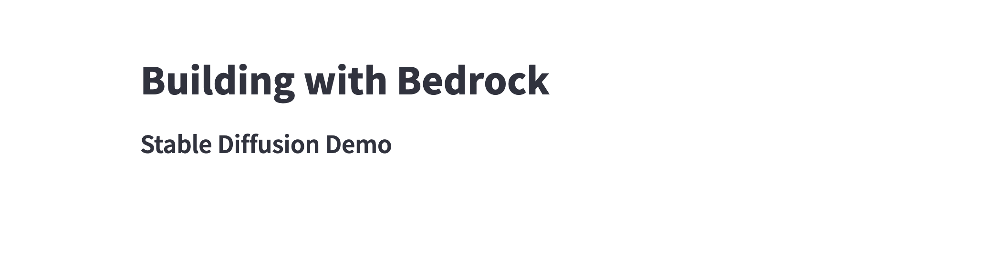

# Building Image Generation Applications with Stable Diffusion

In this module, we will focus on building an image generation application using Stable Diffusion and Streamlit.

* [Streamlit](https://streamlit.io/) allows builders to easily create interactive web apps in Python that provide instant feedback on user responses.

* [Stable Diffusion](https://en.wikipedia.org/wiki/Stable_Diffusion) is a deep learning, text-to-image model released in 2022. It is primarily used to generate detailed images conditioned on text descriptions, though it can also be applied to other tasks such as inpainting, outpainting, and generating image-to-image translations guided by a text prompt.

## Running the Streamlit App

With your workspace fully set up, it's time to get the base application up and running. Run the following command in your terminal:

```bash
streamlit run sd_demo_st.py
```



Ensure that the base application is running correctly. If everything is in order, you'll see something similar to the image above at http://localhost:8501/.

## Building with Bedrock

Now, let's delve into the integration of Amazon Bedrock in our application. We will be updating the code in the `sd_demo_st.py` using your favorite code editor.

The first step is to define the service in our codebase. So, it can be used in our application.

```python
# Define bedrock
bedrock_runtime = boto3.client(
    service_name="bedrock-runtime",
    region_name="us-east-1",
)
```

Next, we need to create a function that makes API calls to the service. This function uses the Stable Diffusion model, along with parameters that you provide, to generate a base64 encoded string. This string represents an image generated by the Stable Diffusion model.

```python
# Bedrock api call to stable diffusion
def generate_image(text, style):
    """
    Purpose:
        Uses Bedrock API to generate an Image
    Args/Requests:
         text: Prompt
         style: style for image
    Return:
        image: base64 string of image
    """
    body = {
        "text_prompts": [{"text": text}],
        "cfg_scale": 10,
        "seed": 0,
        "steps": 50,
        "style_preset": style,
    }

    if style == "None":
        del body["style_preset"]

    body = json.dumps(body)

    modelId = "stability.stable-diffusion-xl"
    accept = "application/json"
    contentType = "application/json"

    response = bedrock_runtime.invoke_model(
        body=body, modelId=modelId, accept=accept, contentType=contentType
    )
    response_body = json.loads(response.get("body").read())

    results = response_body.get("artifacts")[0].get("base64")
    return results
```

The `generate_image` function takes in a text prompt and style as parameters, invokes Bedrock using these parameters, and retrieves a base64 encoded string that can be converted into an image. This is the core of our application's interaction with the Amazon Bedrock. For more details on the parameters checkout the [Stable Diffusion documentation](https://platform.stability.ai/rest-api#tag/v1generation/operation/textToImage)

**Note: Remember to add these code snippets to the `sd_demo_st.py` file.**

## Writing Code with Amazon CodeWhisperer

Ok, now its time to build the rest of our application, we will need the following components for our application

1. **Text Input:** Capture user-provided text prompts for image generation.
2. **Style Select:** Allow users to select the desired style for image generation.
3. **Convert Base64 String to Image:** Converting the Base64 string received from Bedrock to an image.
4. **Display Image:** Displaying the generated image on your Streamlit app when you press a button.


Using Amazon CodeWhisperer can you write prompts to complete the app?


<details>
  <summary>Need help? Try these prompts...</summary>
  
  ### Example Prompts
    ```python
    # Turn base64 string into using PIL
    # Streamlit text area for user input
    # Streamlit select box for user input
    # Bedrock api call to stable diffusion
    ```

    The full code is located in `full_code/sd_full_code_st.py`
</details>


## Running and Testing the Completed Streamlit App
Finally, we run our completed Streamlit application. It's time to put your app to the test! Input some prompts, select styles, and see the magic of Stable Diffusion in action.

Remember you can run the app with

```bash
streamlit run sd_demo_st.py
```